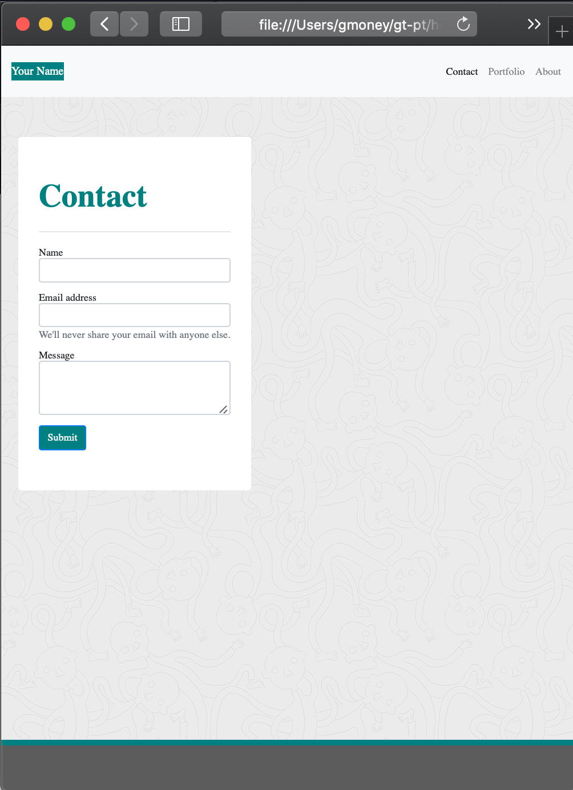

# Responsive-Portfolio

## Table of Contents

- [Description](#description)
- [Screenshots and Links](#screenshot/links)
- [Installation](#installation)
- [Acceptance Criteria](#acceptance-criteria)
- [Credits](#credits)
- [License](#license)

## Description

The Responsive Portfolio is a webpage made up of three different pages. This includes: an About Me page, a Portfolio page and a contact page.

## Screenshots/links
[Responsive-Portfolio](https://github.com/garrettwalter/Responsive-Portfolio)
[Github-Pages](https://garrettwalter.github.io/Responsive-Portfolio/)

## Installation

To  this project you must visit my GitHub page and locate the repository named "Responsive-Portfolio". Once this repository is cloned to your computer, you will be able to edit the files. Any questions can be directed to [Garrett Walter](mailto:gtwalter150@gmail.com). This project can be found here: [Responsive-Portfolio](https://github.com/garrettwalter/Responsive-Portfolio)

## Acceptance Criteria

### Minimum Requirements

- Functional, deployed application

- GitHub repository with README describing the project

- Navbar must be consistent on each page.

- Navbar on each page must contain links to Home/About, Contact, and Portfolio pages.

- All links must work.

- Must use semantic html.

- Each page must have valid and correct HTML. (use a validation service)

<!-- * Must contain your personalized information. (bio, name, images, links to social media, etc.) --> Was instructed not to.

- Must properly utilize Bootstrap components and grid system.

## Credits

## License

This is free and unencumbered software released into the public domain.

Anyone is free to copy, modify, publish, use, compile, sell, or
distribute this software, either in source code form or as a compiled
binary, for any purpose, commercial or non-commercial, and by any
means.

In jurisdictions that recognize copyright laws, the author or authors
of this software dedicate any and all copyright interest in the
software to the public domain. We make this dedication for the benefit
of the public at large and to the detriment of our heirs and
successors. We intend this dedication to be an overt act of
relinquishment in perpetuity of all present and future rights to this
software under copyright law.

THE SOFTWARE IS PROVIDED "AS IS", WITHOUT WARRANTY OF ANY KIND,
EXPRESS OR IMPLIED, INCLUDING BUT NOT LIMITED TO THE WARRANTIES OF
MERCHANTABILITY, FITNESS FOR A PARTICULAR PURPOSE AND NONINFRINGEMENT.
IN NO EVENT SHALL THE AUTHORS BE LIABLE FOR ANY CLAIM, DAMAGES OR
OTHER LIABILITY, WHETHER IN AN ACTION OF CONTRACT, TORT OR OTHERWISE,
ARISING FROM, OUT OF OR IN CONNECTION WITH THE SOFTWARE OR THE USE OR
OTHER DEALINGS IN THE SOFTWARE.

For more information, please refer to <https://unlicense.org>

---

© 2019 Trilogy Education Services, a 2U, Inc. brand. All Rights Reserved.
